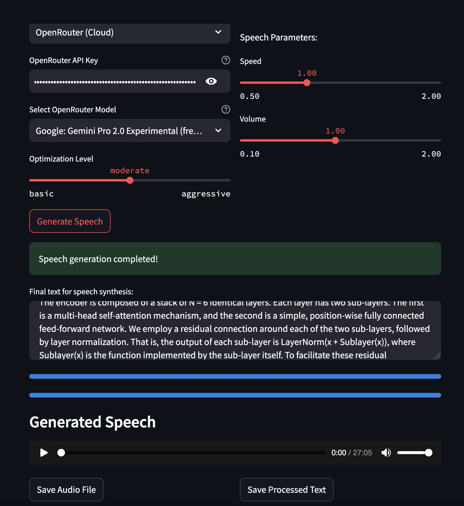

<p align="center">
  <picture>
    <!-- When the user prefers dark mode, show the white logo -->
    <source media="(prefers-color-scheme: dark)" srcset="./images/Blueprint-logo-white.png">
    <!-- When the user prefers light mode, show the black logo -->
    <source media="(prefers-color-scheme: light)" srcset="./images/Blueprint-logo-black.png">
    <!-- Fallback: default to the black logo -->
    
  </picture>
</p>

# Document-to-Speech: a Blueprint by Mozilla.ai for converting documents to natural speech using local AI

[](https://discord.gg/YuMNeuKStr)
[](https://github.com/alexmeckes/Document-To-Speech/actions/workflows/docs.yaml/)
[](https://github.com/alexmeckes/Document-To-Speech/actions/workflows/tests.yaml/)
[](https://github.com/alexmeckes/Document-To-Speech/actions/workflows/lint.yaml/)

This blueprint demonstrates how you can use open-source models & tools to convert input documents into natural-sounding speech.
It is designed to work on most local setups, meaning no external API calls or GPU access is required.
This makes it more accessible and privacy-friendly by keeping everything local.


📘 To explore this project further and discover other Blueprints, visit the [**Blueprints Hub**](https://developer-hub.mozilla.ai/blueprints/create-your-own-speech-from-documents).

## Features

- Convert various document formats (PDF, HTML, TXT, DOCX, MD) to speech
- Support for both American and British English voices
- Multiple voice profiles (male and female options)
- Text optimization for better speech output
- Adjustable speech parameters (speed, volume)
- Local LLM support for text optimization
- Optional cloud-based optimization via OpenRouter
- User-friendly Streamlit interface



### 👉 📖 For more detailed guidance on using this project, please visit our [Docs](https://alexmeckes.github.io/Document-To-Speech/).
### 👉 🔨 Built with
- Python 3.10+ (use Python 3.10-3.12 for compatibility)
- [Llama-cpp](https://github.com/abetlen/llama-cpp-python)
- [Streamlit](https://streamlit.io/) (UI demo)
- [Kokoro TTS](https://github.com/hexgrad/kokoro) (Text-to-Speech)

## Quick-start

Get started right away using the Streamlit interface:

```bash
# Clone the repository
git clone https://github.com/alexmeckes/Document-To-Speech.git
cd document-to-speech

# Create and activate virtual environment (Python 3.10 recommended)
python3.10 -m venv venv
source venv/bin/activate  # On Windows: venv\Scripts\activate

# Install the package
pip install -e .

# Launch the Streamlit app
python -m streamlit run demo/app.py
```

### Command Line Interface

For command-line usage:

```bash
pip install document-to-speech
```

```bash
document-to-speech \
--input_file "example_data/example.pdf" \
--output_file "output.wav" \
--voice_profile "am_michael" \
--speed 1.0 \
--volume 1.0
```

## System requirements
  - OS: Windows, macOS, or Linux
  - Python: >= 3.10, < 3.13
  - Minimum RAM: 8 GB
  - Disk space: 10 GB minimum

## Voice Profiles

Available voice profiles:
- American English (Female): af_sarah, af_bella, af_grace
- American English (Male): am_michael, am_james, am_john
- British English (Female): bf_sarah, bf_bella, bf_grace
- British English (Male): bm_michael, bm_james, bm_john

## Troubleshooting

If you are having issues / bugs, check our [Troubleshooting](https://mozilla-ai.github.io/document-to-speech/getting-started/#troubleshooting) section, before opening a new issue.

## License

This project is licensed under the Apache 2.0 License. See the [LICENSE](LICENSE) file for details.

## Contributing

Contributions are welcome! To get started, you can check out the [CONTRIBUTING.md](CONTRIBUTING.md) file.
